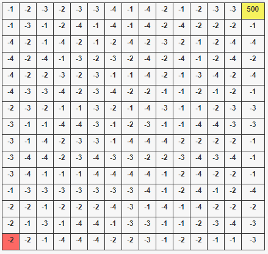
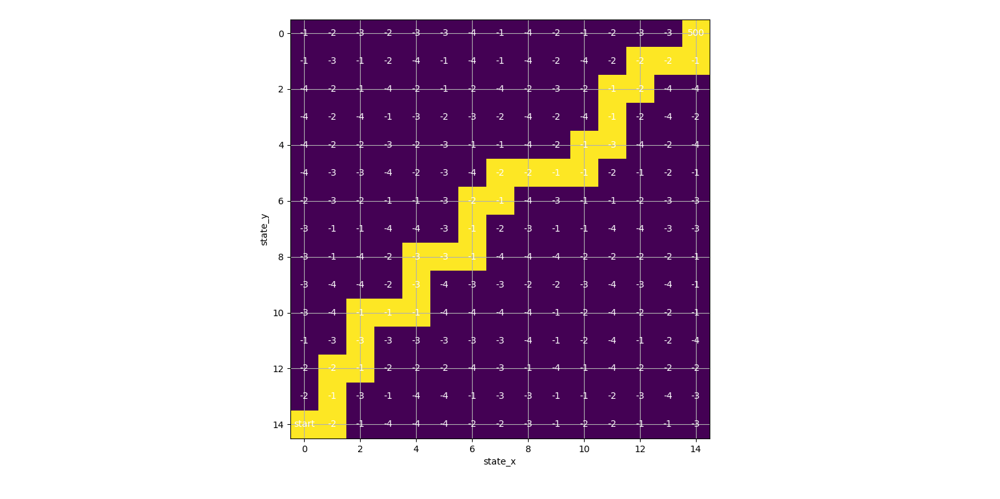

# Q Learning

Q Learning merupakan model algoritma reinforcement learning. Tujuan dari Q Learning yaitu untuk membuat optimal policy yang akan menjadi aturan agent untuk menentukan aksi apa yang harus di ambil. Q Learning yang optimal dapat menghasilkan nilai paling optimum dari environtment. Terdapat dua proses yang terjadi dalam algoritma Q Learning yaitu ekplorasi dan eksploitasi. Eksplorasi merupakan pemilihan aksi secara random untuk mengobservasi environtment. Ekploitasi merupakan pemilihan aksi terbaik, hal ini dilakukan ketika environtment sudah diobservasi terlebih dahulu.

## Environtment

Environtment yang digunakan dalam program ini adalah sebuah gridworld dengan ukuran 15 x 15 dimana setiap state(grid) memiliki nilai reward masing-masing. Setiap state dapat melakukan empat aksi untuk berpindah ke state lainnya, yaitu up(atas), right(kanan), down(bawah) dan left(kiri). State awal ditandai dengan warna orange dan state akhir dengan warna kuning. Reward pada environtment ini disimpan dalam file ['reward.txt'](./reward.txt "reward file").

<!-- image environtment -->

## Algoritma

Langkah awal untuk melakukan Q learning adalah mengetahui environtment. Dalam program ini dilakukan dengan mengimport nilai reward. Kemudian inisialisasi parameter Q Learning yang terdiri dari alpha(learning rate), gamma, num_episodes dan exploration_rate. 

* Nilai <strong>alpha</strong> diset antara 0 hingga 1, berfungsi untuk menentukan seberapa berpengaruh nilai Q yang sebelumnya terhadap nilai Q yang akan di update. 

* Nilai <strong>gamma</strong> diset antara 0 hingga 1, berfungsi untuk menentukan seberapa berpengaruh pemilihan state dan aksi tiap perubahan state dengan pemilihan state dan aksi di awal. 

* exploration_rate awal diset 1 agar algoritma dapat melakukan banyak eksplorasi diawal.

* num_episodes menentukan jumlah episode(iterasi) pembelajaran Q learning.

Setelah inisialisasi parameter, kemudian Q table dibuat. Q table dibuat dengan list berkuruan 15 x 15 x 4. Shape 0 dan shape 1 dari Q table merupakan dimensi dari environtment dan shape 3 sebagai aksi. Index untuk tiap aksi adalah up = 0, right = 1, down = 2, left = 3.

Perhitungan Q learning dilakukan tiap iterasi sebanyak num_eposides. Untuk setiap iterasi dilakukan exploration exploitation trade-off dengan membangkitkan nilai random antara 0 sampai 1. Apabila nilai random kurang dari sama dengan exploration_rate maka akan dilakukan eksplorasi yaitu pemilihan aksi secara random. Apabila nilai random lebih dari nilai exploration_rate maka akan dilakukan pemilihan aksi terbaik. Tiap episode akan berhenti apabila state sudah mencapai finish state yaitu state 0,14 atau jumlah perubahan state sudah melebihi 5000. Setelah satu iterasi episode berakhir, nilai exploration rate akan diturunkan agar diakhir iterasi kemungkinan dilakukan eksploitasi lebih besar.

## Hasil

Hasil dari algoritma Q learning. Mendapatkan step terbaik dari Q table.

